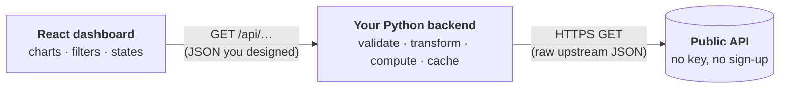
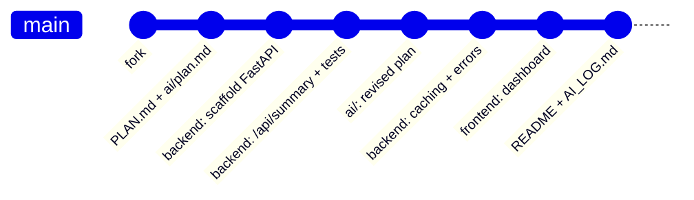

<div align="center">

# Build a Data Dashboard

**A full-stack take-home: a Python backend that turns public API data into something new,
and a React dashboard that shows it off.**

[The task](#the-task) · [Choose an API](#choose-an-api) · [Required docs](#required-documentation) · [What we look for](#what-we-look-for) · [Submitting](#submitting)

</div>

---

## Use AI, and show us how

> [!TIP]
> **Using AI is allowed and encouraged.** Use Claude, ChatGPT, Copilot, Cursor, Claude Code,
> or any other assistant or agent, for planning, design, code, tests, and debugging. We're not
> testing whether you can build this without AI. We're testing **how well you work with it**:
> how you plan, how clearly you direct it, and how critically you review what it produces.

> [!IMPORTANT]
> **Documenting how you worked with AI is required.** Every plan, technical design document (TDD),
> spec, task list, or prompt file you gave to an AI must be committed in an `ai/` folder
> with your solution (see [Required documentation](#required-documentation)).
> **A submission without these documents is incomplete, even if the app works perfectly.**

---

## What you'll build



The browser **only talks to your backend**. Your backend calls the public API, then reshapes the
data and calculates something new before the frontend ever sees it.

---

## The task

| Step | What to do |
| :--: | ---------- |
| **1** | **Pick an API.** Choose one of the [four APIs below](#choose-an-api). Each has a reference file listing its routes, response shapes, and gotchas, written so you can hand it straight to your AI assistant. |
| **2** | **Pick a dashboard.** Each API file ends with four **dashboard ideas**. Build one, combine ideas, or design your own. Your backend must **transform, combine, or compute** something. A pass-through proxy doesn't count. |
| **3** | **Plan it and commit the plan first.** Write your plan or TDD, with AI help if you like, before writing code. Make it your first commit. |
| **4** | **Build the backend in Python.** Expose **at least 2 of your own endpoints** that call the upstream API, reshape the data and/or calculate something (aggregates, rankings, rolling averages, % change, distances, …), return a clean JSON shape *you* designed, and handle upstream failures gracefully (timeouts, bad input, rate limits). |
| **5** | **Build the frontend in React.** A simple dashboard that calls **your** backend, with at least one chart or visual and some way to interact: a filter, date range, search, or selector. |
| **6** | **Document it.** Add the [required docs](#required-documentation), including everything you gave the AI. |

**Suggested time box: 3–4 hours.** We care more about clear thinking and a working slice than a
long feature list.

### Tech stack

| Layer | Required | Suggested tools |
| ----- | -------- | --------------- |
| Backend | **Python** | **FastAPI** (recommended) or Flask · `httpx` or `requests` for upstream calls · Pydantic for response models · `pytest` for tests |
| Frontend | **React** | **Vite** to scaffold (`npm create vite@latest`) · JavaScript or TypeScript · Recharts, Chart.js, or Plotly for charts |

A database is **not** required. In-memory caching is plenty.

---

## Choose an API

All four are free, need **no API key and no sign-up**, and were checked against the live services.

| API | Data | Main backend challenge | Rate limit |
| --- | ---- | ---------------------- | ---------- |
| [**Open-Meteo**](./apis/open-meteo.md) | Weather forecasts, 80+ years of history, air quality, geocoding | Zipping columnar arrays into rows, joining sub-APIs, long-range statistics | 10,000 calls/day |
| [**USGS Earthquakes**](./apis/usgs-earthquakes.md) | Live and historical earthquakes worldwide (GeoJSON) | Flattening GeoJSON, distance math, bucketing and ranking | None published |
| [**Frankfurter**](./apis/frankfurter.md) | Central-bank exchange rates, daily, back to 1999 | Time series with gaps, returns, volatility, moving averages | None published |
| [**Jolpica F1**](./apis/jolpica-f1.md) | Formula 1 results, qualifying, and standings since 1950 | Pagination, string numbers, merging race + sprint results, caching | 4/second, 500/hour |

See [`apis/README.md`](./apis/README.md) for a side-by-side comparison and tips on using the docs with AI.

---

## Required documentation

All of these are **required** unless marked optional. Put them in your `solution/` folder
(see [Submitting](#submitting)).

| File | What goes in it |
| ---- | --------------- |
| `README.md` | How to install and run the backend and frontend (ideally one or two commands each), plus a short description of what the dashboard shows. |
| `PLAN.md` (or a TDD) | Your plan or technical design, **written before you started coding**: the chosen API and dashboard, the endpoint designs (routes, params, response shapes), the frontend layout, and the risks or open questions. Update it as you go. We want to see how the plan changed. |
| `ai/` | **Every plan, TDD, spec, task list, or prompt file you handed to an AI**, exactly as you gave it. Examples: an implementation plan you asked an agent to follow, a spec you pasted into a chat, `CLAUDE.md`, `AGENTS.md`, `.cursorrules`, or agent-generated plan files. Commit revisions too (git history is fine). Exported chat transcripts are welcome. |
| `AI_LOG.md` | A short narrative of how you used AI: which tools, what you asked for at each stage (link to files in `ai/`), what you accepted as-is, what you changed, and **at least one place where the AI was wrong or unhelpful** and how you noticed and fixed it. |
| `DECISIONS.md` | *(Optional.)* Trade-offs, things you'd do with more time, known bugs. |

If a document guided the AI's work, we want to see it. **When in doubt, commit it.**

### Commit history counts

Commit in steps, starting with your plan. Don't squash everything into one commit. A good
history looks something like this:



---

## What we look for

| Area | What good looks like |
| ---- | -------------------- |
| **AI collaboration** | Clear plans and specs given to the AI, critical review of its output, and honest notes on what worked and what didn't. You understand and can explain every line you commit. |
| **Planning** | A clear plan that you actually followed and updated. |
| **Backend design** | Sensible endpoints and response shapes, correct calculations, input validation, and error handling. Bonus points for caching so you don't hammer the free APIs. |
| **Frontend** | It works, it's readable, and it handles loading, empty, and error states. |
| **Communication** | We can run your project from your README in under 5 minutes. |

Tests are welcome but not required. One or two `pytest` tests on your calculation logic go a long way.

---

## Submitting

1. **Fork** this repository.
2. Add your project to your fork in a `solution/` folder next to this README:

   ```text
   take-home/solution/
   ├── README.md
   ├── PLAN.md
   ├── AI_LOG.md
   ├── ai/          # plans, TDDs, specs and prompts you gave the AI
   ├── backend/     # Python
   └── frontend/    # React
   ```

3. Commit your work in steps and push to your fork.
4. Send us the link to your fork. No pull request is needed.

**Before you send it:**

- [ ] The backend and frontend both run from the instructions in `solution/README.md`
- [ ] At least 2 backend endpoints that transform or compute (not a pass-through)
- [ ] `PLAN.md` was the first commit
- [ ] Every plan, TDD, spec, or prompt you gave an AI is in `ai/`
- [ ] `AI_LOG.md` includes at least one place where the AI got something wrong
- [ ] No secrets, `node_modules/`, virtual environments, or build output committed

---

## Tips

- Free public APIs have rate limits and sometimes go down. **Cache** responses and show a friendly
  error when an upstream call fails.
- Run [`./check-apis.sh`](./check-apis.sh) to see whether the four APIs are reachable from your network.
- Give your AI the reference file for your API. It lists the real response shapes and the gotchas
  that most often cause bugs.

<div align="center">

**Questions? Reach out. Asking a clarifying question is a good sign, not a bad one.**

</div>
