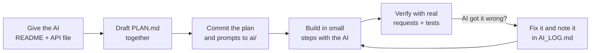

# Choose Your API

Pick **one** of these four APIs. They're all free, need **no API key or sign-up**, and return data
that needs real backend work (reshaping, aggregating, joining, calculating) before it's useful on
a dashboard.

## At a glance

| | [Open-Meteo](./open-meteo.md) | [USGS Earthquakes](./usgs-earthquakes.md) | [Frankfurter](./frankfurter.md) | [Jolpica F1](./jolpica-f1.md) |
|---|---|---|---|---|
| **Domain** | Weather, climate, air quality | Earthquakes worldwide | Currency exchange rates | Formula 1 since 1950 |
| **Data shape** | Columnar arrays (`time[]` + parallel value arrays) | GeoJSON features | Rates keyed by date string | Deeply nested `MRData`, paginated |
| **Rate limit** | 10,000 calls/day (long ranges count as more) | None published | None published | 4/second, 500/hour |
| **Main backend challenge** | Zipping arrays into rows, joining sub-APIs (geocoding + forecast + history + air quality), long-range statistics | Flattening GeoJSON, geo math (haversine), bucketing and ranking | Time series with weekend gaps, returns, volatility, moving averages, cross rates | Pagination, all-string numbers, merging race + sprint results, caching under a tight limit |
| **Good fit if you like** | Weather and maps | Geo and data aggregation | Finance and statistics | Sports and data wrangling |

## What's in each file

| Section | What it gives you |
|---------|-------------------|
| **At a glance** | Base URL, auth, rate limits, format |
| **Endpoints** | The routes and query parameters you'll need |
| **Example requests** | Ready-to-run `curl` commands |
| **Response shape** | Trimmed real JSON responses |
| **Typical backend flow** | A diagram of how data usually moves through your backend for this API |
| **Gotchas** | Details that commonly cause bugs |
| **Dashboard ideas** | Four suggested dashboards, each with what to display, an example endpoint, and the backend work it requires |

You can build one of the suggested dashboards, combine ideas, or design your own. Just make sure
your backend does more than pass data through.

## Using these docs with AI

These files are written to be handed straight to an AI assistant as context. Some ways to use them:

1. **Planning.** Give your assistant [`../README.md`](../README.md) and the file for your chosen API,
   and ask it to help draft `PLAN.md`. Commit the prompt and any plan or TDD you give the AI to your
   `ai/` folder (this is required; see the main README). For example:

   > Read `take-home/README.md` and `take-home/apis/usgs-earthquakes.md`. I want to build the
   > "Earthquakes near a place" dashboard. Propose the backend endpoints: for each one give the
   > route, query params, the upstream calls, the calculations, the response JSON shape, and the
   > error cases. Then sketch the frontend components. Call out rate-limit and caching concerns
   > and anything in the Gotchas section that affects the design.

2. **Typing the upstream data.** Ask it to turn the "Response shape" section into Pydantic models for
   your Python backend (and TypeScript types for your React frontend, if you use TypeScript).

3. **Avoiding known bugs.** Point the assistant at the **Gotchas** section when it writes parsing code.

4. **Checking the AI's work.** These docs are a summary. APIs change, and assistants sometimes invent
   parameters. **Always make a real request** (with `curl`, or `../check-apis.sh`) before you trust a
   route or field. Record in `AI_LOG.md` any time the AI got an API detail wrong.

> [!NOTE]
> Every route, sample request, and response example in these docs was checked against the live APIs
> on 29 September 2026. APIs can change, so the official docs linked at the top of each file are the
> source of truth.
