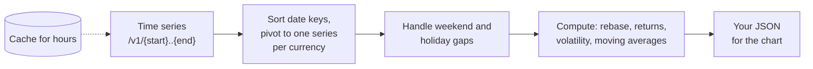

# Frankfurter: Currency Exchange Rates

Open-source exchange-rate API based on reference rates from the European Central Bank
and other central banks.

- **Official docs:** https://frankfurter.dev/
- **Source code:** https://github.com/lineofflight/frankfurter
- **Auth:** none
- **Rate limits:** no hard limit for reasonable use. Rates change once per business day, so cache for hours.
- **Format:** JSON

## Sample data

Real data from this API:

| Currency | 1 USD on 2024-12-31 | 1 USD on 2025-12-31 | Index at year end | Year low | Year high |
|---|---:|---:|---:|---:|---:|
| EUR | 0.96256 | 0.85106 | 88.4 | 0.84481 | 0.98058 |
| GBP | 0.79813 | 0.74264 | 93.0 | 0.72718 | 0.82526 |
| JPY | 156.95 | 156.67 | 99.8 | 140.34 | 158.41 |

*One `/v1/2025-01-01..2025-12-31?base=USD&symbols=EUR,GBP,JPY` call (256 business days), each series divided by its first value and multiplied by 100 so they're comparable. This is the kind of data idea 1 (Currency performance leaderboard) is built on.*

## Versions

There are two versions on the same host:

- **v1** (`https://api.frankfurter.dev/v1`): the API shape is frozen, but its data still updates every business day. It's simple and has 30 major currencies from the ECB. **We recommend v1 for this exercise.**
- **v2** (`https://api.frankfurter.dev/v2`) blends many central-bank providers and covers more currencies. See the official docs if you want to use it.

> The older host `api.frankfurter.app` returns a 301 redirect to `api.frankfurter.dev/v1`. Use the new host
> directly, because some HTTP clients don't follow redirects by default.

## v1 endpoints

| Route | Purpose |
|-------|---------|
| `GET /v1/latest` | Most recent rates |
| `GET /v1/{YYYY-MM-DD}` | Rates on a given date (weekend or holiday → previous business day) |
| `GET /v1/{start}..{end}` | Time series between two dates, e.g. `2024-01-01..2024-06-30` |
| `GET /v1/{start}..` | Time series from a date until today |
| `GET /v1/currencies` | Map of currency code → name |

Query parameters (all optional):

| Param | Example | Notes |
|-------|---------|-------|
| `base` | `USD` | Default `EUR`. `from` is an accepted alias. |
| `symbols` | `EUR,GBP,JPY` | Limit the target currencies. `to` is an accepted alias. |
| `amount` | `250` | Converts this amount instead of 1 |

## Example requests

```bash
curl "https://api.frankfurter.dev/v1/latest?base=USD&symbols=EUR,GBP,JPY"
curl "https://api.frankfurter.dev/v1/2020-03-16?base=USD"
curl "https://api.frankfurter.dev/v1/2024-01-01..2024-06-30?base=USD&symbols=EUR,GBP"
curl "https://api.frankfurter.dev/v1/latest?amount=100&base=USD&symbols=EUR"
curl "https://api.frankfurter.dev/v1/currencies"
```

## Response shapes

Latest or single date:

```json
{ "amount": 1.0, "base": "USD", "date": "2026-09-29",
  "rates": { "EUR": 0.88067, "GBP": 0.75489, "JPY": 157.12 } }
```

Time series (keyed by date). This is the real response for `2024-01-01..2024-06-30`. Notice that it
starts on **2023-12-29**, the last business day before the requested start:

```json
{
  "amount": 1.0, "base": "USD",
  "start_date": "2023-12-29", "end_date": "2024-06-28",
  "rates": {
    "2023-12-29": { "EUR": 0.90498, "GBP": 0.78647 },
    "2024-01-02": { "EUR": 0.91274, "GBP": 0.79085 }
  }
}
```

Currencies:

```json
{ "AUD": "Australian Dollar", "BRL": "Brazilian Real", "EUR": "Euro", "USD": "United States Dollar" }
```

## v2 at a glance (optional)

Endpoints that appear in the v2 docs include `GET /v2/rates?base=USD&quotes=EUR,GBP`,
`GET /v2/rate/{base}/{quote}`, `GET /v2/providers/ecb/rates?date=YYYY-MM-DD`,
and `GET /v2/coverage`. v2 returns flat rows instead of v1's nested objects, e.g.
`/v2/rates?base=USD&quotes=EUR,GBP` →
`[{"date":"2026-09-29","base":"USD","quote":"EUR","rate":0.87945}, ...]`.
v2 values can differ slightly from v1 because they blend several providers. Pick one version and stick with it.

## Typical backend flow

How data usually moves through your backend for this API:



## Gotchas

- Rates are published **once per business day** (around 16:00 CET). There's no data for weekends
  or holidays, so a time series skips those dates. Account for gaps when computing
  "daily" returns or charting.
- A range's `start_date` snaps **back** to the last business day on or before the date you asked for
  (asking for `2024-01-01..` returns data from `2023-12-29`). A single-date request on a weekend returns
  the previous business day's rates, with that earlier `date` in the response.
- Long ranges stay daily and aren't downsampled (10 years ≈ 2,500 dates in one response).
- The time-series `rates` object is keyed by date string. Sort the keys before charting.
  Don't rely on object key order.
- Rates are *reference* rates, not live trading prices.
- An unknown currency code (in `base` or `symbols`) returns HTTP 404 with `{ "message": "not found" }`.
  So does asking for the base currency as a symbol (`?symbols=EUR` with the default `EUR` base).
- **Python's built-in `urllib` is blocked** (HTTP 403 for its default `Python-urllib` User-Agent). Use
  `httpx` or `requests`, which work fine, or set your own `User-Agent` header.
- v1 has exactly 30 currencies (ECB list). Check `/v1/currencies` rather than hard-coding them.

## Dashboard ideas

Pick one of these, or combine parts of them. In each idea, the backend does real work:
it reshapes the date-keyed time series and computes financial statistics. Just returning
the raw rates doesn't count.

### 1. Currency performance leaderboard
**Dashboard shows:** A date-range picker, a line chart of several currencies **rebased to 100** at the
start date (so they're comparable), and a ranked table of % change, volatility, and max drawdown.

**Example endpoint:** `GET /api/fx/performance?base=USD&symbols=EUR,GBP,JPY,CAD&from=2025-01-01&to=2025-12-31`

**Backend work:**
- Turn the `{date: {cur: rate}}` object into sorted per-currency series.
- Rebase each series to 100 at the start date.
- Compute total % change, daily returns, volatility (standard deviation of daily returns), best and
  worst day, and max drawdown.
- Handle the weekend and holiday gaps in the series.

### 2. Trip budget tracker
**Dashboard shows:** The user enters a home currency, an amount, and 2–4 destination currencies. For
each destination, a card shows what the budget is worth today vs 30, 90, and 365 days ago, with a sparkline.

**Example endpoint:** `GET /api/fx/budget?home=USD&amount=2000&destinations=EUR,JPY,MXN`

**Backend work:**
- Fetch one time series covering the last year.
- Pick the nearest available business day for each lookback date, then compute the converted
  amounts and % differences.
- Find the best and worst day in the period to have exchanged the money.

### 3. Trend & moving averages
**Dashboard shows:** One currency pair with 7-day and 30-day moving averages, markers where the
averages cross, and the 52-week high and low, plus where today sits in that range.

**Example endpoint:** `GET /api/fx/trend?base=EUR&quote=USD&days=365`

**Backend work:**
- Compute the rolling averages with correct windows over business days.
- Detect crossovers, compute the 52-week high and low, and express the current rate's position in
  that range as a percentage.

### 4. Cross-rate heatmap
**Dashboard shows:** A matrix of currencies × currencies colored by the % change of each pair over the
chosen period (e.g. how EUR/JPY moved).

**Example endpoint:** `GET /api/fx/matrix?symbols=USD,EUR,GBP,JPY,CHF&from=..&to=..`

**Backend work:**
- Use a **single-base** time series and derive every cross rate yourself
  (rate A→B = rate_B / rate_A), instead of making N² upstream calls.
- Compute the start-to-end % change for every pair.
