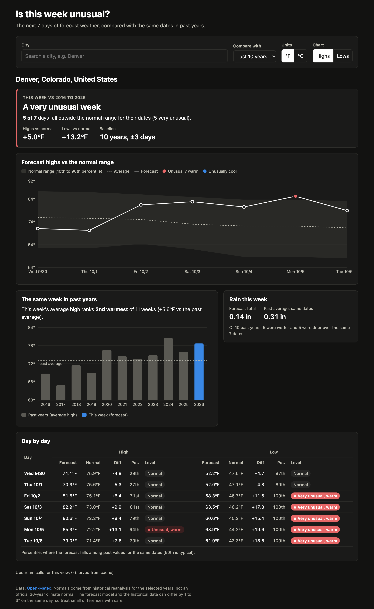
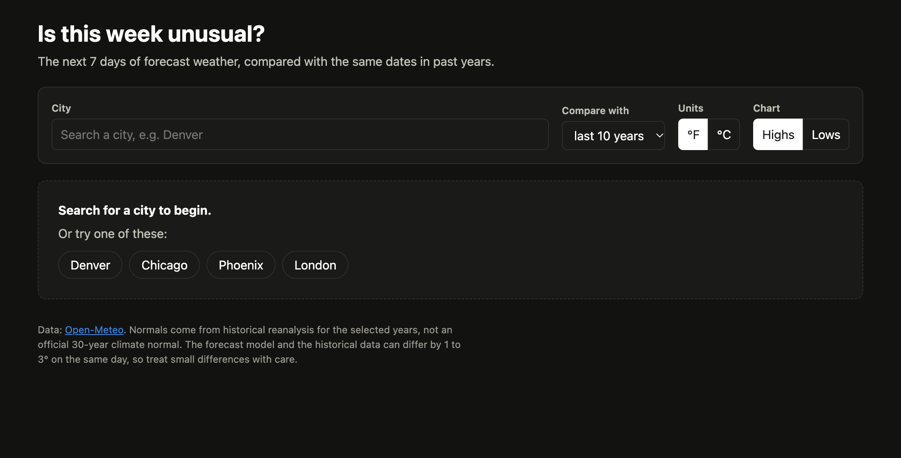
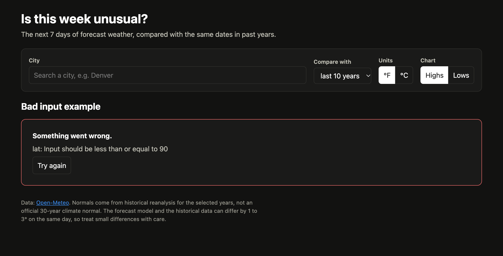

# Is this week unusual?

A dashboard that compares the next 7 days of forecast weather for a city with the same dates in
past years, and says which days are unusual.

- **Backend:** Python, FastAPI, httpx. It calls Open-Meteo (geocoding, forecast, and historical
  archive) and computes the comparison itself.
- **Frontend:** React, Vite, and Recharts. It calls only our backend.



## Run it (about 3 minutes)

Needs Python 3.11+ and Node 20+. No API keys.

**1. Backend** (terminal 1)

```bash
cd take-home/solution/backend
python3 -m venv .venv
source .venv/bin/activate
pip install -r requirements.txt
uvicorn app.main:app --port 8000
```

**2. Frontend** (terminal 2)

```bash
cd take-home/solution/frontend
npm install
npm run dev
```

Open <http://localhost:5173>. Pick a city, or click one of the example cities.

**Tests** (from `backend/`, with the virtual env active):

```bash
python -m pytest
```

There are 68 tests. They cover the math, dates, units, parsing, and every route, with Open-Meteo
mocked, so they need no network.

## What the dashboard shows

- **Verdict:** how many of the next 7 days fall outside the normal range for their dates, and how
  far highs and lows are from normal on average.
- **Week chart:** the forecast against a shaded normal range (10th to 90th percentile of past
  values) and the average. Days that are unusually warm or cool are marked. Toggle highs or lows.
- **Same week in past years:** the average high for these 7 dates in each past year, with this
  week highlighted and ranked.
- **Rain:** this week's forecast total against the same 7 dates in past years.
- **Day-by-day table:** forecast, normal, difference, percentile, and a level for every day.
- **Controls:** city search, baseline length (5, 10, 20, or 30 years), °F or °C, highs or lows.
  The picked city is kept in the URL, so a view can be shared.
- **States:** loading skeletons, an empty state with example cities, "no places match" in the
  search, and error messages with a retry button.

| Empty state | Error state (bad input) |
|---|---|
|  |  |

## How "unusual" is worked out

For each forecast day, the baseline is every value on the same calendar date, plus or minus 3
days, in each past year. At 10 years that is 70 values per day.

- The forecast's percentile rank among those values sets its level:
  - between the 10th and 90th percentile is **normal**
  - outside that range is **unusual**
  - outside the 2nd to 98th percentile is **very unusual**
- The week is **normal** if 0 or 1 days are flagged, **somewhat unusual** for 2 to 4, and
  **very unusual** for 5 to 7.
- Rain is compared as weekly totals, because daily rain is mostly zeros.

Percentiles adjust to each city's own spread. A day 11°F above normal in Denver in the fall can
still be normal, because Denver's fall highs vary a lot. Details and reasoning are in
[docs/PLAN.md](docs/PLAN.md) and [docs/DECISIONS.md](docs/DECISIONS.md).

## API

Interactive docs: <http://localhost:8000/docs>.

| Route | What it does |
|---|---|
| `GET /api/cities?q=Paris&count=5` | City search, cleaned up. No match returns an empty list. |
| `GET /api/weather/anomaly?lat=39.74&lon=-104.98&years=10&units=imperial` | This week vs the normal range, per day and overall |
| `GET /api/weather/same-week?lat=39.74&lon=-104.98&years=10&units=imperial` | This week vs the same week in each past year, with a rank |

Both weather routes also accept `city=Denver` instead of `lat` and `lon`.

Errors always look like this:

```json
{ "error": { "code": "upstream_rate_limited", "message": "...", "retry_after_s": 60 } }
```

| Status | `code` | When |
|---|---|---|
| 422 | `invalid_input` | Bad or missing parameters |
| 404 | `city_not_found` | The city name has no match |
| 503 | `upstream_rate_limited` | Open-Meteo returned 429, or our own call budget is used up. Sends `Retry-After`. |
| 504 | `upstream_timeout` | Open-Meteo timed out, even after one retry |
| 502 | `upstream_error` / `insufficient_history` | Open-Meteo failed, or too few past years loaded |

## Caching and rate limits

- Everything is cached in memory:
  - geocoding for 24 h
  - forecasts for 30 min
  - past-year history for 7 days (it doesn't change)
- History is fetched as one 13-day window per year, which costs about 1 call each. One 10-year
  range would cost about 260.
- A new city at 10 years costs 11 upstream calls and takes under a second. A repeat costs 0.
  `meta.upstream_calls` in each response shows the count.
- Identical requests made at the same moment share one upstream fetch, so the two weather routes
  loading a new city together don't double the calls.
- A sliding 60-second budget refuses calls above 500 a minute, which keeps us under Open-Meteo's
  limit of 600 a minute.

## Project layout

```
backend/
  app/main.py        app, CORS, error handlers
  app/routes.py      the three routes
  app/openmeteo.py   upstream client: timeouts, retry, 429 handling, caching
  app/anomaly.py     the math (pure functions)
  app/dates.py       year shifting, Feb 29
  app/units.py       °C/°F, mm/in
  app/cache.py       TTL cache with in-flight dedup, call budget
  app/models.py      response models
  tests/
frontend/src/
  App.jsx            layout, controls, state
  useApi.js, api.js  fetching, abort, error shape
  components/        CitySearch, WeekChart, SameWeekChart, DayTable, VerdictBanner, RainCard, ...
docs/
  PLAN.md            the plan, written before code
  DECISIONS.md       trade-offs, known limits, next steps
  AI_NOTES.md        how AI was used, key prompts, and what it got wrong
```
